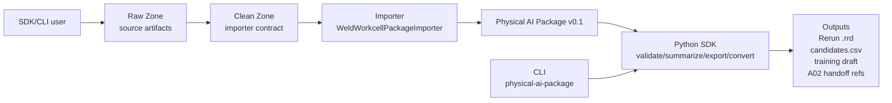

# 工业物理 AI 数据层

B06 是公司工业物理 AI 的横向数据底座项目，目标是在机器人、智能工站、设备时序和系统级协同项目中统一作业数据包、Raw/Clean Zone、回放、训练/评测导出、数据治理和审计边界，使真实物理过程可观察、可复盘、可训练、可追溯。当前第一优先级是支撑 A01 智能焊接工站形成 H300 最小作业窗口数据闭环，并将其中可用证据交给 A02 技能资产底座。

## 如何使用本项目

B06 是一个 Python SDK first 的工业物理 AI 数据层工具包：用 SDK/CLI 把 Clean Zone 工业作业数据和 synthetic/demo Raw/Clean fixture 整理成 Physical AI Package，并导出回放、候选样本、training draft 和 evidence handoff 引用。

| 入口 | 形式 | 适用对象 | 说明 |
| --- | --- | --- | --- |
| SDK | `physical_ai_data` Python package | 研发、平台、数据 pipeline | 主产品入口，用于在 Python 中 validate、summarize、export、convert 和运行 pipeline helper。 |
| CLI | `physical-ai-package ...` | 工程集成、离线验收 | 安装后的标准命令行入口，是 SDK 的薄封装。 |
| Demo fixture | Stage 8 H300 synthetic Raw/Clean | 评审、演示、回归 | 可提交、可复现的 synthetic 样本，用于展示默认链路；不是 H300 真实数据。 |
| scripts | `scripts/*.py` | 兼容、开发生成器 | 保留历史脚本和 fixture 生成器；当 console entrypoint 未安装时可作兼容入口。 |
| Docs/profile | Stage 8 docs、A01/A02 profiles | 业务评审、跨项目 handoff | 说明 synthetic/readiness 边界、A01 字段对齐和 A02 evidence handoff 口径。 |



三分钟跑通默认 Stage 8 synthetic 链路：

```bash
python -m pip install -e ".[dev]"
python scripts/generate_stage8_h300_synthetic_demo.py --output-root artifacts/stage8/h300_synthetic_demo --frames 5
physical-ai-package run-weld-workcell \
  --clean-root artifacts/stage8/h300_synthetic_demo/clean/weld_workcell \
  --output-dir artifacts/stage8/h300_synthetic_demo/package \
  --training-split eval \
  --output-rrd artifacts/stage8/h300_synthetic_demo/package.rrd
```

Python SDK 调用示例：

```python
from physical_ai_data.pipelines import run_weld_workcell_pipeline

result = run_weld_workcell_pipeline(
    clean_root="artifacts/stage8/h300_synthetic_demo/clean/weld_workcell",
    output_dir="artifacts/stage8/h300_synthetic_demo/package",
    training_split="eval",
    output_rrd="artifacts/stage8/h300_synthetic_demo/package.rrd",
)

print(result.summary)
```

`physical-ai-package` 是安装后的标准 CLI；`python scripts/physical_ai_package.py ...` 仅保留为 entrypoint 尚未安装时的兼容入口。

Stage 10 adoption path 建议按这个顺序执行：

1. 先用 Stage 8 synthetic fixture 跑通 SDK/CLI 默认链路。
2. 阅读 [B06 Python SDK](docs/sdk/README.md) 和 [SDK adoption checklist](docs/sdk/adoption_checklist.md)，确认 API、输出物和数据边界。
3. 运行 [SDK pipeline example](examples/sdk_pipeline_stage8.py)、[existing package operations example](examples/sdk_existing_package_ops.py)、[low-level importer example](examples/sdk_low_level_importer.py) 或 `bash examples/cli_json_smoke.sh /tmp/b06_stage10_cli_json_smoke`。
4. 按 [Stage 8 pipeline walkthrough](docs/sdk/stage8_pipeline_walkthrough.md) 复核完整 adoption flow。
5. 替换为真实/脱敏 H300 Clean Zone 前，先运行 [Stage 11 H300 sample replacement readiness](docs/stage11/README.md)，用 `assess_h300_sample_readiness(...)` 或 `physical-ai-package assess-h300-readiness --clean-root ... --raw-root ... --json` 检查候选 Clean/Raw roots。
6. 根据 Stage 11 report 和 [Stage 8 H300 synthetic-to-real gap register](docs/stage8/h300_synthetic_to_real_gap_register.md) 人工检查字段、脱敏、权限和证据缺口，再决定是否进入受控目录中的真实/脱敏样本替换 smoke。

Stage 10 只强化 SDK/CLI adoption，不新增 production connector、DB/schema、完整 Web 平台或 H300 现场协议。轻量 demo UI 仅保留为后续评估项，口径见 [demo UI evaluation](docs/sdk/demo_ui_evaluation.md)。

## 项目定位

B06 不定位为通用 IoT 平台，也不定位为生产 connector 项目。它的职责是把真实、脱敏或仿真的工业物理过程数据整理成可追溯的数据资产，支撑 A01 智能焊接工站、A02 机器人技能大师、B08 设备时序样板和 S01 系统级事件闭环。

Rerun 在本项目中是可替换 replay backend 和开发期观察工具，不是主数据结构。Physical AI Package、Raw/Clean Zone、profile contract、候选样本和证据 handoff 才是 B06 的主要交付边界。

## 主链路

共享上游链路统一处理数据接入、清洗、打包、回放和候选导出；不同项目按各自 profile 消费证据、候选样本或结果引用：

```text
Raw Zone
-> Clean Zone
-> Physical AI Package
-> Rerun 回放
-> candidate sample export
-> training/evaluation draft
   - A01: job-window evidence / field-alignment references
   - A02: ManipulationSkillAsset evidence handoff
   - B08: timeseries observation candidates / result references
   - S01: manufacturing event context / evidence references
```

这里的 `training/evaluation draft` 是 draft sample index，不是正式训练框架格式，也不代表四类项目都消费同一种训练/评测数据。

## 当前第一样板

当前第一样板是 **Stage 8 A01 H300 synthetic demo readiness**。本阶段在仍无真实或脱敏 H300 样本的前提下，用 H300-oriented synthetic Raw/Clean fixture 展示 B06 现有离线闭环，并把后续真实替换需要关闭的问题沉淀为 `synthetic-to-real gap register`。

Stage 8 展示 Raw Zone、Clean Zone、`weld_workcell` importer、Physical AI Package、Rerun 回放、candidate sample export、training/evaluation draft 和 A02 evidence handoff 的 readiness。它不是 real data pilot，不代表 H300 现场协议、生产 connector、DB ingestion、长期 DB schema 或 Physical AI Package schema changes 已经完成。Stage 7.1 继续作为 A01 H300 Clean Zone contract 和 simulated fixture 的历史基线。

Stage 10 adoption path 之后的下一步是 **Stage 11 H300 sample replacement readiness**：在不提交真实样本、不声称 real data pilot 完成的前提下，用 readiness checker 评估候选 `weld_workcell` Clean Zone 和可选 Raw Zone evidence。Stage 12 的首个脱敏样本替换试点，需要等至少一条脱敏 H300 最小作业窗口样本完成访问和提交边界确认后再启动。

## 当前可用能力

- **Physical AI Package v0.1**：当前主数据包结构，用于承载任务上下文、设备、工件、坐标系、帧、事件、标签、指标和 artifact 引用。
- **Raw/Clean Zone 约定**：用于区分来源 payload、清洗后 contract、可回放 package、临时 artifact 和不可提交数据。
- **Stage 8 H300 synthetic demo fixture**：可生成 H300-oriented synthetic Raw/Clean fixture，展示 Stage 7.1 语义如何进入现有 `weld_workcell` Clean Zone contract，并记录真实替换缺口。
- **Stage 8 readiness docs**：提供能力链路可视化、`synthetic-to-real gap register` 和 A02 evidence handoff synthetic example，用于工程/A01/A02 评审下一步真实样本替换。
- **Stage 11 sample replacement readiness**：提供 `assess_h300_sample_readiness(...)` SDK 和 `physical-ai-package assess-h300-readiness` CLI，用于对候选 H300 Clean/Raw roots 做替换前检查；它是样本替换门禁，不是 real data pilot 完成态。
- **Stage 7.1 simulated Raw/Clean fixture**：可生成 A01 H300 最小焊接作业窗口替代样本，并让 Clean Zone 对齐现有 `weld_workcell` importer contract。
- **Weld workcell importer candidate**：`WeldWorkcellPackageImporter` 可承接本地机器人焊接工站业务导出目录，是 Clean Zone offline importer contract 和 handoff contract，不是生产 connector。
- **validate / summarize / candidate export**：可对 package 做开发期校验、概要汇总，并导出 `derived/candidates.csv` 候选样本。
- **Rerun `.rrd` adapter**：可把 Physical AI Package 转换为 Rerun `.rrd`，用于开发期回放和观察。
- **Training/evaluation draft export v0.2**：可导出 `physical-ai-training-eval-draft/v0.2`，作为后续标注、评估和正式训练格式转换前的 draft sample index。
- **Python SDK / pipeline helper / importer contract**：提供 `physical_ai_data` Python 调用层、`run_weld_workcell_pipeline` 和外部 importer contract，封装 validate、summarize、candidate export、Rerun convert 和 draft export。
- **LeRobot / CSV / simulation fixture**：用于离线验证数据包结构、importer contract 和开放数据承接能力。

## 四类项目 profile

- [Profile 总览](docs/profiles/README.md)
- [A01 H300 最小焊接作业窗口 profile](docs/profiles/a01_weld_workcell_job_window.md)
- [A02 ManipulationSkillAsset evidence profile](docs/profiles/a02_manipulation_skill_asset_evidence.md)
- [B08 设备时序观测 profile](docs/profiles/b08_equipment_timeseries_observation_package.md)
- [S01 制造事件上下文 profile](docs/profiles/s01_manufacturing_event_context_package.md)
- [B06 -> A02 evidence handoff](docs/profiles/b06_to_a02_evidence_handoff.md)

## 工程对接方式

工程/机器人团队当前优先提供离线目录、脱敏样本、字段说明和验收 checklist，而不是直接建设生产 connector。A01 H300 对接优先阅读：

- [Stage 8 A01 H300 synthetic demo readiness](docs/stage8/README.md)
- [Stage 11 H300 sample replacement readiness](docs/stage11/README.md)
- [Stage 8 capability visualization report](docs/stage8/capability_visualization_report.md)
- [Stage 8 H300 synthetic-to-real gap register](docs/stage8/h300_synthetic_to_real_gap_register.md)
- [Stage 8 A02 evidence handoff synthetic example](docs/stage8/a02_evidence_demo_example.md)
- [B06 Python SDK](docs/sdk/README.md)
- [Stage 7.1 A01 H300 最小焊接作业窗口数据试点](docs/stage7/README.md)
- [A01 H300 真实/脱敏样本请求清单](docs/stage7/sample_request_checklist.md)
- [A01 H300 Raw/Clean Zone 试点约定](docs/stage7/raw_clean_zone_pilot.md)
- [H300 字段与 weld_workcell Clean contract 对齐](docs/stage7/h300_weld_workcell_field_alignment.md)
- [Stage 5 工程团队对接文档](docs/stage5/engineering_handoff.md)

Stage 5 的离线 handoff 仍可用于脱敏样本交换、回归测试、离线验收和现场无法直连时的临时导入。Stage 6 的真机数据资产模块文档仍作为后续真实数据进入 AI 控制器后的接入、存储、清洗和治理边界参考。

## 当前边界

- B06 不是通用 IoT 平台，不负责普通设备联网、现场网络接入或通用工业协议平台化。
- 当前不做生产 connector，不实现 TCP/IP server、SDK bridge、OPC UA/MES/HMI/PLC 直连或 DB ingestion。
- 当前不新增长期 DB schema，不修改 Physical AI Package v0.1 schema，不把 simulated/synthetic fixture 定义为 H300 现场协议。
- 真实数据来自现场或真机原始数据，不应直接提交仓库。
- 脱敏数据需要确认客户、工单、人员、路径、图像和点云等敏感信息处理结果；未确认前默认按本地 artifact 或 onsite-only 处理。
- 仿真数据是仓库内默认可提交、可运行、可复现的样本。
- 临时 artifact 包括本地生成的 package、`.rrd`、candidates、training draft、Raw/Clean 输出，应放在 `artifacts/` 或 `/tmp`，默认不提交。
- 不可提交数据包括客户现场原始文件、未脱敏图像/点云、账号密钥、内部网络地址、权限配置和商业敏感字段。

## 快速开始

默认开发安装：

```bash
python -m pip install -e ".[dev]"
```

生成当前 Stage 8 H300 synthetic demo/readiness fixture：

```bash
python scripts/generate_stage8_h300_synthetic_demo.py --output-root artifacts/stage8/h300_synthetic_demo --frames 5
```

用标准 CLI 从 Clean Zone 生成 package、training draft 和 Rerun `.rrd`：

```bash
physical-ai-package run-weld-workcell \
  --clean-root artifacts/stage8/h300_synthetic_demo/clean/weld_workcell \
  --output-dir artifacts/stage8/h300_synthetic_demo/package \
  --training-split eval \
  --output-rrd artifacts/stage8/h300_synthetic_demo/package.rrd
```

运行测试：

```bash
python -m pytest -q
```

## 常用命令

以下命令以 Stage 8 synthetic demo 为输入目录，覆盖当前 SDK-first 离线默认链路：

```bash
physical-ai-package run-weld-workcell \
  --clean-root artifacts/stage8/h300_synthetic_demo/clean/weld_workcell \
  --output-dir artifacts/stage8/h300_synthetic_demo/package \
  --training-split eval \
  --output-rrd artifacts/stage8/h300_synthetic_demo/package.rrd
physical-ai-package validate artifacts/stage8/h300_synthetic_demo/package --json
physical-ai-package summarize artifacts/stage8/h300_synthetic_demo/package --json
physical-ai-package export-candidates artifacts/stage8/h300_synthetic_demo/package
physical-ai-package export-training-draft artifacts/stage8/h300_synthetic_demo/package --split eval
physical-ai-package convert-rerun artifacts/stage8/h300_synthetic_demo/package --output-rrd artifacts/stage8/h300_synthetic_demo/package.rrd
```

`python scripts/physical_ai_package.py ...` 仍可用于旧环境或未安装 console entrypoint 的兼容场景；新接入优先使用 `physical-ai-package ...`。

LeRobot 真实开放数据导入仍使用 Stage 4 文档中的 `uv` 可选环境和 `import-lerobot` 命令。

## 总体路线规划

本项目采用“先借力验证，再外围封装，最后形成自有数据层”的路线推进。Rerun.io 在当前阶段优先作为实验底座和参考架构，而不是一开始就作为不可替换的产品内核。

### 阶段 0：项目启动与资料沉淀

目标是建立项目基线，沉淀启动文档、调研目录、执行记录和协作规范。当前阶段已完成仓库初始化、README、details、docs 目录和第一批 Rerun.io 调研文档。

### 阶段 1：Rerun.io 深度调研

目标是拆解 Rerun.io 的产品定位、数据模型、SDK、Viewer、存储格式、Catalog、查询、训练导出、扩展机制、许可证和商业边界，明确哪些能力值得借鉴、复用、封装、二次开发或自研替代。

### 阶段 2：Rerun.io 本地技术评测

目标是用 Rerun 跑通最小多模态实验，验证图像、点云、机器人位姿、轨迹、日志、事件、工艺参数和模型输出的记录、回放、查询和导出能力。该阶段重点回答“Rerun 能不能支撑我们第一批样板场景”。

### 阶段 3：Simulation-first 数据包链路

目标是在不接入真机的前提下，用机器人焊接工站和机械臂抓取/分拣两个仿真样例，跑通 Physical AI Package schema、validator、候选导出、Rerun adapter 和 CLI。真实机器人或智能工站的一次作业闭环顺延到后续样板场景阶段。

### 阶段 4：LeRobot 开放数据样板链路

目标是在不接入真机、不训练模型的前提下，将 LeRobot 开放机器人操作数据导入 Physical AI Package，形成 import adapter、CLI、profile 映射、多相机 Rerun adapter 支持和 PushT/ALOHA 样板验收命令。这样既能复用 Rerun 作为回放后端，又能验证 Physical AI 数据包对真实社区数据的承接能力。

### 阶段 5：业务接入与交付文档

目标是形成面向工程团队和机器人团队的最小交付文档包，包括项目入口、业务导出 contract、字段说明、调用方式、产出物、验收 checklist 和常见错误说明。本阶段不新增生产 connector、不接真实现场系统、不扩展 package schema。

### 阶段 6：真机数据接入与数据资产化试点

目标是围绕 AI 控制器侧真实机器人作业数据，明确接入、Raw Zone、Clean Zone、Physical AI Package、Rerun 回放和训练数据准备的第一版链路。Stage 5 离线 handoff contract 继续用于脱敏样本交换、回归测试和离线验收；Stage 6 主线转为真机数据进入 AI 控制器后的存储、清洗、整理、回放和数据资产化试点。本阶段继续保持 Rerun 为可替换回放 backend，不新增生产 connector、TCP/IP server、SDK bridge 或 DB schema。

### 阶段 7.1：A01 H300 最小焊接作业窗口数据试点

目标是在真机接入条件尚未具备时，将 Stage 7 的 deterministic simulated Raw/Clean fixture 收束到 A01 H300 最小焊接作业窗口，验证 Raw Zone -> Clean Zone -> `weld_workcell` importer -> Physical AI Package -> validate/summarize/candidates/training draft/Rerun 的离线闭环，并通过 profile contract 说明 A01/A02/B08/S01 各自如何消费 evidence、候选样本或结果引用。本阶段为真实/脱敏 H300 样本替换做准备，不实现生产 connector、长期 DB schema 或 Physical AI Package schema changes。

### 阶段 8：A01 H300 synthetic demo readiness

目标是在真实/脱敏 H300 样本尚未到位时，提供第二轮 H300-oriented synthetic demo/readiness：独立生成 Stage 8 Raw/Clean fixture，复用现有 `weld_workcell` importer 和 Physical AI Package v0.1 链路，形成 capability visualization、`synthetic-to-real gap register` 和 A02 evidence handoff 示例。本阶段不称为真实数据试点，不新增 connector、DB/schema 或 package schema changes；真实/脱敏样本替换在样本到位后按 gap register 继续推进。

### 阶段 9：SDK-first 用户入口收敛

目标是把 B06 的主入口收束为 Python SDK first：`physical_ai_data` 作为主产品 SDK，`physical-ai-package` 作为安装后的标准 CLI，`scripts/` 保留为 synthetic fixture 生成器和兼容入口。

### 阶段 10：SDK adoption hardening

目标是让研发、平台和工程团队稳定采用 SDK/CLI：补齐 SDK guide、adoption checklist、walkthrough、examples、CLI JSON smoke 和错误信息 polish。本阶段不实现 production connector，不新增 DB/schema、完整 Web 平台或 H300 现场协议。

### 阶段 11：H300 sample replacement readiness

目标是在 Stage 8 synthetic baseline 和 Stage 10 adoption path 之后，提供 H300 sample replacement readiness 文档、SDK/CLI 检查入口和 gap 状态解释。Stage 11 要求候选样本至少能提供 `weld_workcell` Clean Zone root，可选 Raw Zone root 只作为 source artifact evidence；真实/脱敏 H300 样本继续保留在 local/onsite controlled directories，不提交仓库。本阶段不实现 production connector，不修改 Physical AI Package v0.1 schema，也不声明 real data pilot 完成。Stage 12 只有在至少一条脱敏 H300 最小作业窗口样本的访问和提交边界确认后再进入。

## 近期输出物

- 竞品与开源生态调研报告
- Rerun.io 技术评测报告
- 样板场景数据链路
- 数据格式与接口规范
- 数据集整理流程
- Stage 5 工程团队 handoff 文档包
- Stage 6 真机数据接入与数据资产化文档包
- Stage 7.1 A01 H300 最小焊接作业窗口数据试点文档包
- Stage 7.1 simulated Raw/Clean fixture generator
- Stage 8 A01 H300 synthetic demo/readiness 文档包
- Stage 8 H300 synthetic demo fixture generator
- H300 synthetic-to-real gap register
- A02 evidence handoff synthetic example
- Stage 9 SDK-first 用户入口和 SDK 文档
- Stage 10 SDK adoption hardening 文档包、examples、CLI JSON smoke 和错误信息 polish
- Stage 11 H300 sample replacement readiness 文档和 SDK/CLI readiness checker 入口
- A01/A02/B08/S01 project profile contract 文档包
- real-data 真机准备截图索引
- 自研路线判断

## 文档目录

- [Physical AI 数据层项目启动说明](docs/260606_PhysicalAI数据层项目启动说明.md)
- [B06 Robotic IOT 与物理数据层课题](docs/03-B06_RoboticIOT与物理数据层课题.md)
- [调研目录](docs/research/README.md)
- [Rerun.io 阶段二本地技术评测设计](docs/superpowers/specs/2026-06-07-rerun-stage-2-local-evaluation-design.md)
- [阶段二运行说明](docs/stage2/README.md)
- [Rerun.io 阶段二本地技术评测报告](docs/research/04-rerun阶段二本地技术评测报告.md)
- [Simulation-first Physical AI Data Package 设计](docs/superpowers/specs/2026-06-08-simulation-first-physical-ai-data-package-design.md)
- [阶段三运行说明](docs/stage3/README.md)
- [Physical AI 数据包阶段三实施记录](docs/research/05-physical-ai数据包阶段三实施记录.md)
- [Stage 4 LeRobot 开放数据样板链路运行说明](docs/stage4/README.md)
- [LeRobot 到 Physical AI Package 映射](docs/research/06-lerobot到physical-ai-package映射.md)
- [LeRobot 开放数据样板链路记录](docs/research/06-lerobot开放数据样板链路记录.md)
- [Stage 4.2 SDK Wrapper / External Importer 边界设计](docs/superpowers/specs/2026-06-10-sdk-wrapper-importer-boundary-design.md)
- [Stage 4.2 SDK Wrapper / External Importer Boundary 实施计划](docs/superpowers/plans/2026-06-10-sdk-wrapper-importer-boundary.md)
- [Stage 4.3 Training/Evaluation Export Contract 与非 LeRobot Importer 设计](docs/superpowers/specs/2026-06-10-stage-4-3-training-importer-contract-design.md)
- [Stage 4.3 Training Importer Contract 实施计划](docs/superpowers/plans/2026-06-10-stage-4-3-training-importer-contract.md)
- [Stage 4.4 Weld Workcell 业务 Importer 设计](docs/superpowers/specs/2026-06-10-stage-4-4-weld-workcell-importer-design.md)
- [Stage 4.4 Weld Workcell Importer 实施计划](docs/superpowers/plans/2026-06-10-stage-4-4-weld-workcell-importer.md)
- [Stage 5 业务接入与交付文档设计](docs/superpowers/specs/2026-06-11-stage-5-handoff-docs-design.md)
- [Stage 5 Handoff Docs 实施计划](docs/superpowers/plans/2026-06-11-stage-5-handoff-docs.md)
- [Stage 5 业务接入与交付文档](docs/stage5/README.md)
- [Stage 5 工程团队对接文档](docs/stage5/engineering_handoff.md)
- [Stage 6 真机数据接入与数据资产化设计](docs/superpowers/specs/2026-06-11-stage-6-real-robot-ingestion-design.md)
- [Stage 6 真机数据接入与数据资产化实施计划](docs/superpowers/plans/2026-06-11-stage-6-real-robot-ingestion.md)
- [Stage 6 真机数据接入与数据资产化](docs/stage6/README.md)
- [真机数据资产模块定位](docs/stage6/real_robot_data_asset_module.md)
- [真机字段分层与映射](docs/stage6/real_data_field_mapping.md)
- [Stage 6 真机接入准备资料](docs/real-data/README.md)
- [Stage 7 仿真优先小作业窗口数据试点设计](docs/superpowers/specs/2026-06-16-stage-7-simulated-small-job-window-pilot-design.md)
- [Stage 7 Simulated Small Job Window Pilot 实施计划](docs/superpowers/plans/2026-06-16-stage-7-simulated-small-job-window-pilot.md)
- [Stage 7.1 工业物理 AI profile 对齐设计](docs/superpowers/specs/2026-06-22-stage-7-1-industrial-physical-ai-profile-alignment-design.md)
- [Stage 7.1 工业物理 AI profile 对齐计划](docs/superpowers/plans/2026-06-22-stage-7-1-industrial-physical-ai-profile-alignment.md)
- [Stage 7.1 A01 H300 最小焊接作业窗口数据试点](docs/stage7/README.md)
- [Stage 7.1 A01 H300 真实/脱敏样本请求清单](docs/stage7/sample_request_checklist.md)
- [Stage 7.1 A01 H300 Raw/Clean Zone 试点约定](docs/stage7/raw_clean_zone_pilot.md)
- [H300 字段对齐](docs/stage7/h300_weld_workcell_field_alignment.md)
- [Stage 8 H300 synthetic demo readiness 设计](docs/superpowers/specs/2026-06-22-stage-8-h300-synthetic-demo-readiness-design.md)
- [Stage 8 H300 synthetic demo readiness 实施计划](docs/superpowers/plans/2026-06-22-stage-8-h300-synthetic-demo-readiness.md)
- [Stage 8 A01 H300 synthetic demo readiness](docs/stage8/README.md)
- [Stage 8 capability visualization report](docs/stage8/capability_visualization_report.md)
- [Stage 8 H300 synthetic-to-real gap register](docs/stage8/h300_synthetic_to_real_gap_register.md)
- [Stage 8 A02 evidence handoff synthetic example](docs/stage8/a02_evidence_demo_example.md)
- [Stage 11 H300 sample replacement readiness](docs/stage11/README.md)
- [B06 Python SDK](docs/sdk/README.md)
- [SDK adoption checklist](docs/sdk/adoption_checklist.md)
- [Stage 8 SDK pipeline walkthrough](docs/sdk/stage8_pipeline_walkthrough.md)
- [Demo UI evaluation](docs/sdk/demo_ui_evaluation.md)
- [SDK pipeline example](examples/sdk_pipeline_stage8.py)
- [Profile 总览](docs/profiles/README.md)
- [A01 H300 profile](docs/profiles/a01_weld_workcell_job_window.md)
- [A02 ManipulationSkillAsset evidence profile](docs/profiles/a02_manipulation_skill_asset_evidence.md)
- [B08 设备时序观测 profile](docs/profiles/b08_equipment_timeseries_observation_package.md)
- [S01 制造事件上下文 profile](docs/profiles/s01_manufacturing_event_context_package.md)
- [B06 -> A02 evidence handoff](docs/profiles/b06_to_a02_evidence_handoff.md)
- [项目执行细节](details.md)
- [AI 协作规范](AGENTS.md)

## 文档分工

README 记录项目定位、使用入口、主链路、当前第一样板、当前能力、profile 入口、工程对接方式、快速开始和当前边界，保持在项目级概览层面。更细的执行记录、当前完成事项、下一步计划和阶段性决策记录在 [details.md](details.md) 中。SDK API 说明由 [B06 Python SDK](docs/sdk/README.md) 承载；工程团队对接字段、导出目录、验收 checklist、gap register、Stage 11 sample replacement readiness 和常见错误由 Stage 5、Stage 7.1、Stage 8、Stage 11 和 profile 文档共同承载。

## 交付流程

阶段性任务完成后，按任务范围同步更新对应文档，再通过远端 Pull Request 合并到 `main`。PR 在远端合并完成后，清理对应本地开发分支，保持本地工作区干净。

## 当前状态

本仓库目前用于承载项目启动文档、调研材料、实验记录、接口规范、原型代码、Stage 5 业务接入 handoff 文档和 Stage 8 H300 synthetic demo/readiness 文档包。阶段二已经跑通 Rerun 本地技术评测的最小闭环；阶段三已有 simulation-first Physical AI 数据包 runnable package、validator、Rerun adapter 和 CLI prototype，覆盖机器人焊接工站与机械臂抓取/分拣两个仿真样例，并已完成两个样例包的生成、校验、汇总、候选 CSV 导出、`.rrd` 转换和 `rerun rrd verify` smoke。

阶段四已形成 LeRobot 开放数据 import adapter、lazy loader、`import-lerobot` CLI、PushT/ALOHA/fallback profile、候选指标扩展和 Rerun 多相机引用支持。Stage 4.1 已建立独立 `uv` 环境并跑通真实 `lerobot/pusht` quick smoke、`lerobot/pusht` full acceptance 命令链路与 `lerobot/aloha_static_towel` 多相机 representative smoke，最终回归为 `99 passed`。

Stage 4.2 已新增最小 SDK wrapper、external importer contract、`LeRobotPackageImporter` contract 实现、training/evaluation draft export 和 `export-training-draft` CLI；这些能力用于把现有原型边界沉淀为可被 Python 调用、可被外部 importer 扩展的最小接口层。

Stage 4.3 已收紧 training/evaluation draft export contract 到 `physical-ai-training-eval-draft/v0.2`，明确 draft manifest、samples 字段、split 允许值和“非正式训练框架格式”边界；同时新增离线 `CsvRecordingPackageImporter` fixture，用本地单文件 CSV recording 证明 external importer contract 不是 LeRobot 专用接口。当前自动化环境 native Rerun GUI 启动失败，Viewer/Blueprint 人工视觉验收仍需在 GUI 可用环境补做。

Stage 4.4 已新增离线 `WeldWorkcellPackageImporter` 业务 importer candidate，用本地机器人焊接工站导出目录验证多文件业务输入、工艺参数、事件、人工复核标签和图片引用如何进入 `robot_welding_station` Physical AI Package。该能力不新增 CLI、不接真实机器人/PLC/MES/HMI，也不改变默认离线可测试路径；输出 package 已验证可继续进入 validate、summarize、candidate export、training/evaluation draft export 和 Rerun `.rrd` adapter。

Stage 5 当前已形成业务接入与交付文档：根 README 作为项目入口，Stage 5 文档承载工程团队 handoff，Stage 4 文档继续记录 LeRobot、CSV fixture 和 Weld Workcell importer candidate 的技术细节。

Stage 6 已新增真机数据接入与数据资产化文档包，包括 `docs/stage6/README.md`、`docs/stage6/real_robot_data_asset_module.md`、`docs/stage6/real_data_field_mapping.md` 和 `docs/real-data/README.md`。`docs/real-data/1.jpg` 与 `docs/real-data/2.jpg` 当前作为 Stage 6 真机准备截图，用于支撑系统通讯关系、字段来源、优先级和待确认问题梳理。

Stage 7.1 已将 Stage 7 simulated Raw/Clean fixture 收束为 A01 H300 最小焊接作业窗口数据试点：`scripts/generate_stage7_sim_window.py` 保留为无真机条件下的历史基线，Clean Zone 对齐现有 `WeldWorkcellPackageImporter` contract，并可继续进入 Physical AI Package 的 validate、summarize、candidate export、training/evaluation draft 和 Rerun `.rrd` adapter 链路。`docs/profiles/` 已补充 A01、A02、B08、S01 四类 profile 和 B06 -> A02 evidence handoff，明确共享上游链路与 profile-specific consumption。

Stage 8 当前新增 `scripts/generate_stage8_h300_synthetic_demo.py` 和 `docs/stage8/` readiness 文档包：用独立 H300 synthetic fixture 跑通 Raw/Clean -> Package -> Rerun/candidates/training draft -> A02 evidence handoff 示例，并用 `h300_synthetic_to_real_gap_register.md` 记录真实/脱敏替换需要逐条关闭的问题。

Stage 9 已完成 SDK 化与用户入口收敛：B06 对外定位为 Python SDK first，`physical_ai_data` 是主产品入口，`physical-ai-package` 是标准 CLI 薄封装，`scripts/` 保留为兼容和开发期生成器。Stage 10 已完成 SDK adoption hardening：补齐 SDK API guide、adoption checklist、notebook-style walkthrough、可运行 examples、CLI JSON smoke、常见错误信息 polish 和 smoke tests。当前推荐从 Stage 8 synthetic Clean Zone 通过 `run_weld_workcell_pipeline`、`physical-ai-package run-weld-workcell` 或 `examples/` 跑通默认链路；Stage 10 之后的下一步是 Stage 11 sample replacement readiness，用 `assess_h300_sample_readiness(...)` 或 `physical-ai-package assess-h300-readiness` 检查候选 Clean/Raw roots，再按 gap register 推进受控目录中的真实/脱敏样本替换。
