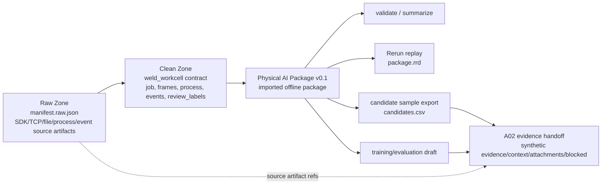

# Stage 8 capability visualization report

## 数据链路图

Stage 8 用 H300 synthetic fixture 展示当前 B06 离线能力链路。Raw Zone 承载 source payload 和 H300-only source artifacts；Clean Zone 只承载 `WeldWorkcellPackageImporter` 已支持的 contract；Physical AI Package 承接后续 validate、summarize、Rerun replay、candidates、training draft 和 A02 evidence handoff。



## H300 synthetic 时间线

| 时间 | 阶段 | Stage 8 synthetic 内容 | 当前落点 | A02 handoff 价值 |
| --- | --- | --- | --- | --- |
| 0.0000s | approach | 机器人接近 synthetic H300 seam，记录 TCP pose 和首帧图像引用 | `raw/sdk/robot_state.ndjson`、`clean/weld_workcell/frames.csv` | 作为 context，说明动作起点和图像参考 |
| 1.0000s | weld start | `arc_start` 事件、工艺参数进入焊接区间 | `raw/events/event_log.ndjson`、`clean/weld_workcell/events.csv`、`process.csv` | 作为 evidence 候选，标记技能执行开始 |
| 1.0000s-3.0000s | weld | TCP 路径、焊接电流/电压/送丝/速度、缺陷概率模拟值 | `frames.csv`、`process.csv`、`robot_trajectory.json` | 作为路径与工艺 context |
| 2.0000s | review label | synthetic 质量标签 `acceptable_with_endpoint_correction` | `clean/weld_workcell/review_labels.csv` | 可作为人工确认 evidence 的占位示例 |
| 3.0000s | manual review | endpoint correction 风险和人工修正记录 | `manual_corrections.json`、`events.csv` | 可说明失败边界和专家审查需要 |
| 4.0000s | cooldown | 冷却结束、质量结果归档 | `quality_result.json` | 作为 quality context 和 blocked 替换提醒 |

## 字段落点表

| Field/sample group | Raw artifact | Clean contract | Package output | A02 handoff category |
| --- | --- | --- | --- | --- |
| 工单/任务/窗口 ID | `manifest.raw.json`、`h300_job_window_story.json` | `job.json` 中保留 synthetic 工单、设备、工件字段 | Package metadata / entities | context，真实样本到来后替换 |
| 机器人 TCP pose | `sdk/robot_state.ndjson`、`robot_trajectory.json` | `frames.csv` | frames / trajectory-like references | evidence 候选，需真实时间戳来源 |
| 焊接工艺参数 | `process/welding_process.csv` | `process.csv` | metrics / process records | context 或 evidence 辅助 |
| 事件/报警 | `events/event_log.ndjson` | `events.csv` | events | evidence 候选，真实报警字典待补 |
| 图像引用 | `files/images/front_0000.png` | `images/front_0000.png` 和 `frames.csv.image_path` | artifact references | attachment_reference |
| 点云占位 | `files/point_clouds/window_0000.pcd` | 无结构化字段 | source artifact reference only | attachment_reference，等待真实点云 |
| PCL seam candidates | `files/pcl_seam_candidates.json` | 无结构化字段 | source artifact reference only | context / attachment_reference |
| 模型输出 | `files/model_outputs.json` | 无结构化字段 | source artifact reference only | context，版本与置信度待真实替换 |
| 人工修正 | `files/manual_corrections.json` | `review_labels.csv` 只保留 review summary | labels / source refs | evidence 候选 |
| 质量结果 | `files/quality_result.json` | `review_labels.csv` 只保留质量标签摘要 | labels / source refs | evidence 或 blocked，取决于真实复核口径 |

## 文件树

```text
artifacts/stage8/h300_synthetic_demo/
  raw/                                      # 可提交 synthetic fixture 输出，不是现场协议
    .stage8_h300_synthetic_demo_generated
    manifest.raw.json
    sdk/robot_state.ndjson
    tcp_json/hmi_task_messages.ndjson
    files/
      robot_program.lua
      robot_trajectory.json
      seam_trajectory.json
      h300_job_window_story.json
      pcl_seam_candidates.json
      model_outputs.json
      manual_corrections.json
      quality_result.json
      images/front_0000.png
      point_clouds/window_0000.pcd
    process/welding_process.csv
    events/event_log.ndjson
  clean/weld_workcell/                     # Clean Zone importer contract
    .stage8_h300_synthetic_demo_generated
    job.json
    frames.csv
    process.csv
    events.csv
    review_labels.csv
    images/front_0000.png
  package/                                 # 本地生成 artifact，默认不提交
    physical_ai_manifest.json
    ...
  package.rrd                              # 本地 Rerun replay artifact，默认不提交
```

## 状态板

| 状态 | 内容 | 当前判断 |
| --- | --- | --- |
| 当前已能做 | 生成 Stage 8 H300 synthetic Raw/Clean fixture；从 Clean Zone 导入 Physical AI Package；运行 validate、summarize、export-candidates、export-training-draft、convert-rerun；形成 A02 evidence handoff 示例 | 可在离线开发环境复现 |
| 需要真实数据后才能做 | 真实工单/任务 ID 替换、控制器时间戳评审、真实点云/PCL、相机/手眼标定、真实模型输出、人工审查来源、质量检测口径、AI 控制器存储权限确认 | 进入 `gap register` 逐条关闭 |
| 明确不做 | 生产 connector、DB ingestion、长期 DB schema、Physical AI Package v0.1 schema change、A02 schema 定义、现场敏感数据入库或入仓库 | 保持在 Stage 8 边界外 |

## 读图结论

Stage 8 的重点不是把 Raw source artifacts 全部结构化进 Clean Zone，而是把当前能跑通的 Clean Zone -> Physical AI Package 链路展示清楚，并把 H300 synthetic 与真实/脱敏样本之间的差距显性化。真实样本到来后，先用 `gap register` 判断是否需要 importer、connector、DB/schema 或 package schema 的后续扩展。
