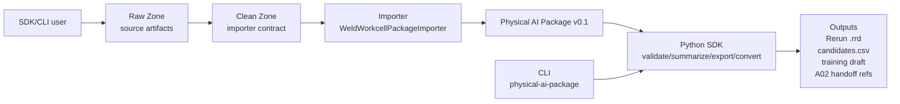

# Stage 9 SDK Productization Implementation Plan

> **For agentic workers:** REQUIRED SUB-SKILL: Use superpowers:subagent-driven-development (recommended) or superpowers:executing-plans to implement this plan task-by-task. Steps use checkbox (`- [ ]`) syntax for tracking.

**Goal:** 将 B06 收敛为 Python SDK first 的工业物理 AI 数据层工具包，提供标准 console entrypoint、薄 pipeline helper、清晰 README 架构图和用户使用流程。

**Architecture:** 保持现有 `physical_ai_data` 包结构，新增 `physical_ai_data.pipelines` 作为少量 convenience helper；CLI 继续是 argparse 薄层，直接调用 SDK/pipeline；`scripts/` 仅保留为兼容 wrapper。Stage 9 不引入 registry、插件系统、Web app、DB schema 或 production connector。

**Tech Stack:** Python 3.11+, dataclasses, pathlib, argparse, pytest, setuptools `[project.scripts]`, Mermaid docs。

---

## File Structure

- Modify `pyproject.toml`: add console script `physical-ai-package = "physical_ai_data.cli:main"`.
- Modify `src/physical_ai_data/importers.py`: allow `ImportRequest.output_dir: str | Path`; normalize to `Path` in `run_import`.
- Create `src/physical_ai_data/pipelines.py`: define `PipelineResult` and `run_weld_workcell_pipeline`.
- Modify `src/physical_ai_data/cli.py`: add `run-weld-workcell` subcommand that calls the pipeline helper.
- Leave `src/physical_ai_data/__init__.py` top-level exports unchanged unless tests prove a narrow import update is required; pipeline is imported from `physical_ai_data.pipelines`.
- Modify `tests/physical_ai_data/test_importers.py`: cover `str` output_dir normalization.
- Create `tests/physical_ai_data/test_pipelines.py`: cover pipeline success, optional outputs, import failure, defensive validation failure.
- Modify `tests/physical_ai_data/test_cli.py`: cover pyproject console entrypoint metadata and `run-weld-workcell` CLI behavior.
- Keep `tests/physical_ai_data/test_lerobot_cli.py` as existing `import-lerobot` regression coverage.
- Modify `README.md`: add "如何使用本项目", SDK/CLI/scripts/demo relationship, Mermaid architecture diagram, three-minute flow.
- Modify `details.md`: record Stage 9 decision, deliverables, verification, and next-stage direction.
- Modify `docs/stage8/README.md`: align Stage 8 demo instructions with SDK/pipeline/CLI entrypoints.
- Create `docs/sdk/README.md`: concise SDK API and boundary reference.

## Implementation Rules

- Keep SDK style Pythonic: plain functions, small dataclasses, `str | Path`, explicit directories.
- Do not add a registry, builder DSL, plugin lifecycle, connector abstraction, Web dependency, or database layer.
- Do not remove `scripts/physical_ai_package.py` or existing subcommands.
- Preserve current default usability: after any task commit, `python -m pytest -q` should be able to pass.
- Use TDD for behavior changes: write or update tests first, run failing targeted tests, implement minimal code, rerun targeted tests, commit.

### Task 1: Console Entrypoint and ImportRequest Path Normalization

**Files:**
- Modify: `pyproject.toml`
- Modify: `src/physical_ai_data/importers.py`
- Modify: `tests/physical_ai_data/test_importers.py`
- Modify: `tests/physical_ai_data/test_cli.py`

- [ ] **Step 1: Add failing importer normalization test**

In `tests/physical_ai_data/test_importers.py`, add:

```python
def test_run_import_normalizes_string_output_dir(tmp_path: Path):
    calls: list[ImportRequest] = []

    @dataclass
    class CapturingImporter:
        source_format: str = "fake"

        def import_package(self, request: ImportRequest) -> ImportResult:
            calls.append(request)
            return ImportResult(
                package_root=request.output_dir,
                source_format=self.source_format,
                source_id="fake-source",
                frame_count=1,
            )

    output_dir = tmp_path / "package"
    request = ImportRequest(source_format="fake", source={}, output_dir=str(output_dir))

    result = run_import(CapturingImporter(), request)

    assert calls
    assert calls[0].output_dir == output_dir
    assert isinstance(calls[0].output_dir, Path)
    assert result.package_root == output_dir
```

- [ ] **Step 2: Add failing console script metadata test**

In `tests/physical_ai_data/test_cli.py`, add imports:

```python
import tomllib
```

Then add:

```python
def test_pyproject_exposes_physical_ai_package_console_script():
    pyproject = tomllib.loads(Path("pyproject.toml").read_text(encoding="utf-8"))

    assert pyproject["project"]["scripts"]["physical-ai-package"] == "physical_ai_data.cli:main"
```

- [ ] **Step 3: Run targeted tests and confirm failure**

Run:

```bash
python -m pytest tests/physical_ai_data/test_importers.py::test_run_import_normalizes_string_output_dir tests/physical_ai_data/test_cli.py::test_pyproject_exposes_physical_ai_package_console_script -q
```

Expected: both fail; importer test fails because `output_dir` stays `str`, pyproject test fails because `[project.scripts]` is missing.

- [ ] **Step 4: Implement minimal importer normalization**

In `src/physical_ai_data/importers.py`, change imports and dataclass:

```python
from dataclasses import dataclass, field, replace
from pathlib import Path

@dataclass(frozen=True)
class ImportRequest:
    source_format: str
    source: Mapping[str, object]
    output_dir: str | Path
    options: Mapping[str, object] = field(default_factory=dict)
```

Update `run_import`:

```python
def run_import(importer: PackageImporter, request: ImportRequest) -> ImportResult:
    if importer.source_format != request.source_format:
        raise ValueError(f"Importer source_format {importer.source_format} cannot handle {request.source_format}")
    normalized_request = replace(request, output_dir=Path(request.output_dir))
    return importer.import_package(normalized_request)
```

- [ ] **Step 5: Add console script metadata**

In `pyproject.toml`, after `[project.optional-dependencies]` blocks or before `[tool.uv]`, add:

```toml
[project.scripts]
physical-ai-package = "physical_ai_data.cli:main"
```

- [ ] **Step 6: Run targeted tests and confirm pass**

Run:

```bash
python -m pytest tests/physical_ai_data/test_importers.py::test_run_import_normalizes_string_output_dir tests/physical_ai_data/test_cli.py::test_pyproject_exposes_physical_ai_package_console_script -q
```

Expected: `2 passed`.

- [ ] **Step 7: Run related regression tests**

Run:

```bash
python -m pytest tests/physical_ai_data/test_importers.py tests/physical_ai_data/test_lerobot_cli.py -q
```

Expected: all pass.

- [ ] **Step 8: Commit**

```bash
git add pyproject.toml src/physical_ai_data/importers.py tests/physical_ai_data/test_importers.py tests/physical_ai_data/test_cli.py
git commit -m "feat: add package entrypoint and path-friendly imports"
```

### Task 2: Weld Workcell Pipeline SDK

**Files:**
- Create: `src/physical_ai_data/pipelines.py`
- Create: `tests/physical_ai_data/test_pipelines.py`
- Optionally inspect: `src/physical_ai_data/sdk.py`, `src/physical_ai_data/weld_workcell_importer.py`, `src/physical_ai_data/stage8_h300_demo.py`

- [ ] **Step 1: Write failing pipeline success test**

Create `tests/physical_ai_data/test_pipelines.py`:

```python
from __future__ import annotations

import json
from pathlib import Path

import pytest

from physical_ai_data.schema import ValidationMessage, ValidationResult
from physical_ai_data.stage8_h300_demo import generate_stage8_h300_synthetic_demo


def test_run_weld_workcell_pipeline_generates_package_outputs(tmp_path: Path):
    from physical_ai_data.pipelines import PipelineResult, run_weld_workcell_pipeline

    fixture = generate_stage8_h300_synthetic_demo(tmp_path / "stage8_demo")
    package_root = tmp_path / "package"
    output_rrd = tmp_path / "package.rrd"

    result = run_weld_workcell_pipeline(
        clean_root=str(fixture.clean_root),
        output_dir=str(package_root),
        training_split="eval",
        output_rrd=str(output_rrd),
    )

    assert isinstance(result, PipelineResult)
    assert result.package_root == package_root
    assert result.validation.ok
    assert result.summary["frame_count"] == 5
    assert result.candidates_csv == package_root / "derived" / "candidates.csv"
    assert result.candidates_csv.is_file()
    assert result.training_draft_dir == package_root / "derived" / "training_eval"
    assert (result.training_draft_dir / "training_eval_manifest.json").is_file()
    assert json.loads((result.training_draft_dir / "training_eval_manifest.json").read_text(encoding="utf-8"))["split"] == "eval"
    assert result.rrd_path == output_rrd
    assert result.rrd_path.is_file()
```

- [ ] **Step 2: Write failing optional output test**

Append:

```python
def test_run_weld_workcell_pipeline_can_skip_optional_outputs(tmp_path: Path):
    from physical_ai_data.pipelines import run_weld_workcell_pipeline

    fixture = generate_stage8_h300_synthetic_demo(tmp_path / "stage8_demo")
    package_root = tmp_path / "package"

    result = run_weld_workcell_pipeline(
        clean_root=fixture.clean_root,
        output_dir=package_root,
        export_candidates=False,
        training_split=None,
    )

    assert result.validation.ok
    assert result.candidates_csv is None
    assert result.training_draft_dir is None
    assert result.rrd_path is None
    assert not (package_root / "derived" / "candidates.csv").exists()
    assert not (package_root / "derived" / "training_eval").exists()
```

- [ ] **Step 3: Write failing import/package-build error test**

Append:

```python
def test_run_weld_workcell_pipeline_wraps_import_failures(tmp_path: Path):
    from physical_ai_data.pipelines import run_weld_workcell_pipeline

    fixture = generate_stage8_h300_synthetic_demo(tmp_path / "stage8_demo")
    (fixture.clean_root / "process.csv").unlink()

    with pytest.raises(ValueError, match="weld_workcell pipeline failed during import") as exc_info:
        run_weld_workcell_pipeline(clean_root=fixture.clean_root, output_dir=tmp_path / "package")

    assert "process.csv" in str(exc_info.value)
```

- [ ] **Step 4: Write failing defensive validation error test**

Append:

```python
def test_run_weld_workcell_pipeline_reports_defensive_validation_failure(
    tmp_path: Path,
    monkeypatch: pytest.MonkeyPatch,
):
    import physical_ai_data.pipelines as pipelines
    from physical_ai_data.pipelines import run_weld_workcell_pipeline

    fixture = generate_stage8_h300_synthetic_demo(tmp_path / "stage8_demo")

    def fake_validate(package_root: str | Path) -> ValidationResult:
        return ValidationResult(
            errors=[ValidationMessage("forced_invalid", "forced validation failure", str(package_root))],
            summary={"frame_count": 0},
        )

    monkeypatch.setattr(pipelines, "validate", fake_validate)

    with pytest.raises(ValueError, match="weld_workcell pipeline produced invalid package") as exc_info:
        run_weld_workcell_pipeline(clean_root=fixture.clean_root, output_dir=tmp_path / "package")

    assert "forced_invalid" in str(exc_info.value)
```

- [ ] **Step 5: Run pipeline tests and confirm failure**

Run:

```bash
python -m pytest tests/physical_ai_data/test_pipelines.py -q
```

Expected: fail because `physical_ai_data.pipelines` does not exist.

- [ ] **Step 6: Implement minimal pipeline module**

Create `src/physical_ai_data/pipelines.py`:

```python
from __future__ import annotations

from dataclasses import dataclass
from pathlib import Path

from physical_ai_data.importers import ImportRequest, run_import
from physical_ai_data.schema import ValidationMessage, ValidationResult
from physical_ai_data.sdk import (
    convert_to_rerun,
    export_candidates_csv,
    export_training_eval_draft,
    summarize,
    validate,
)
from physical_ai_data.weld_workcell_importer import WeldWorkcellPackageImporter

__all__ = ["PipelineResult", "run_weld_workcell_pipeline"]


@dataclass(frozen=True)
class PipelineResult:
    package_root: Path
    validation: ValidationResult
    summary: dict[str, object]
    candidates_csv: Path | None
    training_draft_dir: Path | None
    rrd_path: Path | None


def run_weld_workcell_pipeline(
    clean_root: str | Path,
    output_dir: str | Path,
    *,
    copy_images: bool = True,
    export_candidates: bool = True,
    candidate_min_score: float = 0.5,
    training_split: str | None = "unspecified",
    output_rrd: str | Path | None = None,
) -> PipelineResult:
    try:
        import_result = run_import(
            WeldWorkcellPackageImporter(),
            ImportRequest(
                source_format="weld_workcell",
                source={"root": Path(clean_root)},
                output_dir=Path(output_dir),
                options={"copy_images": copy_images},
            ),
        )
    except Exception as exc:
        raise ValueError(f"weld_workcell pipeline failed during import: {exc}") from exc

    package_root = import_result.package_root
    validation = validate(package_root)
    if not validation.ok:
        raise ValueError(
            "weld_workcell pipeline produced invalid package: "
            + _format_validation_errors(validation.errors)
        )

    summary = summarize(package_root)
    candidates_csv = (
        export_candidates_csv(package_root, min_score=candidate_min_score)
        if export_candidates
        else None
    )
    training_draft_dir = (
        export_training_eval_draft(package_root, split=training_split)
        if training_split is not None
        else None
    )
    rrd_path = convert_to_rerun(package_root, output_rrd) if output_rrd is not None else None

    return PipelineResult(
        package_root=package_root,
        validation=validation,
        summary=summary,
        candidates_csv=candidates_csv,
        training_draft_dir=training_draft_dir,
        rrd_path=rrd_path,
    )


def _format_validation_errors(errors: list[ValidationMessage]) -> str:
    return "; ".join(f"{error.code}: {error.message}" for error in errors)
```

- [ ] **Step 7: Run pipeline tests and confirm pass**

Run:

```bash
python -m pytest tests/physical_ai_data/test_pipelines.py -q
```

Expected: all pipeline tests pass.

- [ ] **Step 8: Run Stage 8 importer-chain regression**

Run:

```bash
python -m pytest tests/physical_ai_data/test_stage8_h300_demo.py tests/physical_ai_data/test_weld_workcell_importer.py -q
```

Expected: all pass.

- [ ] **Step 9: Commit**

```bash
git add src/physical_ai_data/pipelines.py tests/physical_ai_data/test_pipelines.py
git commit -m "feat: add weld workcell SDK pipeline"
```

### Task 3: CLI run-weld-workcell Thin Wrapper

**Files:**
- Modify: `src/physical_ai_data/cli.py`
- Modify: `tests/physical_ai_data/test_cli.py`

- [ ] **Step 1: Add failing CLI argument mapping test**

In `tests/physical_ai_data/test_cli.py`, add:

```python
def test_cli_run_weld_workcell_maps_args_to_pipeline(monkeypatch, tmp_path: Path, capsys):
    from physical_ai_data import cli
    from physical_ai_data.pipelines import PipelineResult

    calls = []

    def fake_pipeline(**kwargs):
        calls.append(kwargs)
        package_root = tmp_path / "package"
        return PipelineResult(
            package_root=package_root,
            validation=ValidationResult(summary={"frame_count": 5}),
            summary={"package_id": "pkg", "frame_count": 5},
            candidates_csv=package_root / "derived" / "candidates.csv",
            training_draft_dir=package_root / "derived" / "training_eval",
            rrd_path=tmp_path / "package.rrd",
        )

    monkeypatch.setattr(cli, "run_weld_workcell_pipeline", fake_pipeline)

    result = cli.main(
        [
            "run-weld-workcell",
            "--clean-root",
            str(tmp_path / "clean" / "weld_workcell"),
            "--output-dir",
            str(tmp_path / "package"),
            "--no-copy-images",
            "--candidate-min-score",
            "0.8",
            "--training-split",
            "eval",
            "--output-rrd",
            str(tmp_path / "package.rrd"),
        ]
    )

    captured = capsys.readouterr()
    assert result == 0
    assert calls == [
        {
            "clean_root": tmp_path / "clean" / "weld_workcell",
            "output_dir": tmp_path / "package",
            "copy_images": False,
            "export_candidates": True,
            "candidate_min_score": 0.8,
            "training_split": "eval",
            "output_rrd": tmp_path / "package.rrd",
        }
    ]
    assert "Wrote Physical AI Package" in captured.out
    assert str(tmp_path / "package") in captured.out
```

- [ ] **Step 2: Add failing JSON and optional-output CLI tests**

Append:

```python
def test_cli_run_weld_workcell_json_handles_disabled_outputs(monkeypatch, tmp_path: Path, capsys):
    from physical_ai_data import cli
    from physical_ai_data.pipelines import PipelineResult

    calls = []

    def fake_pipeline(**kwargs):
        calls.append(kwargs)
        return PipelineResult(
            package_root=tmp_path / "package",
            validation=ValidationResult(summary={"frame_count": 5}),
            summary={"frame_count": 5},
            candidates_csv=None,
            training_draft_dir=None,
            rrd_path=None,
        )

    monkeypatch.setattr(cli, "run_weld_workcell_pipeline", fake_pipeline)

    result = cli.main(
        [
            "run-weld-workcell",
            "--clean-root",
            str(tmp_path / "clean"),
            "--output-dir",
            str(tmp_path / "package"),
            "--no-candidates",
            "--training-split",
            "none",
            "--json",
        ]
    )

    captured = capsys.readouterr()
    payload = json.loads(captured.out)
    assert result == 0
    assert calls[0]["export_candidates"] is False
    assert calls[0]["training_split"] is None
    assert payload["package_root"] == str(tmp_path / "package")
    assert payload["candidates_csv"] is None
    assert payload["training_draft_dir"] is None
    assert payload["rrd_path"] is None
```

- [ ] **Step 3: Add failing CLI smoke test against Stage 8 fixture**

Append:

```python
def test_cli_run_weld_workcell_stage8_smoke(tmp_path: Path):
    from physical_ai_data.stage8_h300_demo import generate_stage8_h300_synthetic_demo

    fixture = generate_stage8_h300_synthetic_demo(tmp_path / "stage8_demo")
    package_root = tmp_path / "package"
    output_rrd = tmp_path / "package.rrd"

    result = _run(
        [
            "run-weld-workcell",
            "--clean-root",
            str(fixture.clean_root),
            "--output-dir",
            str(package_root),
            "--training-split",
            "eval",
            "--output-rrd",
            str(output_rrd),
        ]
    )

    assert result.returncode == 0, result.stderr
    assert (package_root / "physical_ai_manifest.json").is_file()
    assert (package_root / "derived" / "candidates.csv").is_file()
    assert (package_root / "derived" / "training_eval" / "training_eval_manifest.json").is_file()
    assert output_rrd.is_file()
```

- [ ] **Step 4: Run targeted CLI tests and confirm failure**

Run:

```bash
python -m pytest tests/physical_ai_data/test_cli.py::test_cli_run_weld_workcell_maps_args_to_pipeline tests/physical_ai_data/test_cli.py::test_cli_run_weld_workcell_json_handles_disabled_outputs tests/physical_ai_data/test_cli.py::test_cli_run_weld_workcell_stage8_smoke -q
```

Expected: fail because `run-weld-workcell` is not implemented.

- [ ] **Step 5: Implement CLI parser**

In `src/physical_ai_data/cli.py`, import:

```python
from physical_ai_data.pipelines import PipelineResult, run_weld_workcell_pipeline
```

In `_build_parser()`, before `import-lerobot`, add:

```python
    weld_pipeline = subcommands.add_parser(
        "run-weld-workcell",
        help="Import a weld workcell Clean Zone and export common package outputs.",
    )
    weld_pipeline.add_argument("--clean-root", type=Path, required=True, help="Clean Zone weld_workcell directory.")
    weld_pipeline.add_argument("--output-dir", type=Path, required=True, help="Output Physical AI Package directory.")
    weld_pipeline.add_argument("--copy-images", dest="copy_images", action="store_true", default=True, help="Copy image artifacts into the package.")
    weld_pipeline.add_argument("--no-copy-images", dest="copy_images", action="store_false", help="Keep image refs without copying images.")
    weld_pipeline.add_argument("--no-candidates", dest="export_candidates", action="store_false", default=True, help="Skip candidates.csv export.")
    weld_pipeline.add_argument("--candidate-min-score", type=float, default=0.5, help="Minimum candidate score.")
    weld_pipeline.add_argument("--training-split", default="unspecified", help="Training draft split; use 'none' to skip.")
    weld_pipeline.add_argument("--output-rrd", type=Path, help="Optional Rerun .rrd output path.")
    weld_pipeline.add_argument("--json", action="store_true", help="Emit machine-readable JSON.")
    weld_pipeline.set_defaults(func=_run_weld_workcell)
```

Add handler:

```python
def _run_weld_workcell(args: argparse.Namespace) -> int:
    result = run_weld_workcell_pipeline(
        clean_root=args.clean_root,
        output_dir=args.output_dir,
        copy_images=args.copy_images,
        export_candidates=args.export_candidates,
        candidate_min_score=args.candidate_min_score,
        training_split=_optional_training_split(args.training_split),
        output_rrd=args.output_rrd,
    )
    payload = _pipeline_payload(result)
    if args.json:
        _print_json(payload)
    else:
        print(f"Wrote Physical AI Package: {result.package_root}")
        if result.candidates_csv is not None:
            print(f"Wrote candidates: {result.candidates_csv}")
        if result.training_draft_dir is not None:
            print(f"Wrote training/evaluation draft: {result.training_draft_dir}")
        if result.rrd_path is not None:
            print(f"Wrote Rerun recording: {result.rrd_path}")
    return 0
```

Add helpers near `_validation_payload`:

```python
def _optional_training_split(value: str | None) -> str | None:
    if value is None:
        return "unspecified"
    normalized = value.strip()
    if normalized.lower() in {"", "none", "null"}:
        return None
    return normalized


def _pipeline_payload(result: PipelineResult) -> dict[str, object]:
    return {
        "package_root": str(result.package_root),
        "validation": {
            "ok": result.validation.ok,
            "summary": result.validation.summary,
            "errors": [asdict(error) for error in result.validation.errors],
            "warnings": [asdict(warning) for warning in result.validation.warnings],
        },
        "summary": result.summary,
        "candidates_csv": str(result.candidates_csv) if result.candidates_csv is not None else None,
        "training_draft_dir": str(result.training_draft_dir) if result.training_draft_dir is not None else None,
        "rrd_path": str(result.rrd_path) if result.rrd_path is not None else None,
    }
```

- [ ] **Step 6: Run targeted CLI tests and confirm pass**

Run:

```bash
python -m pytest tests/physical_ai_data/test_cli.py::test_cli_run_weld_workcell_maps_args_to_pipeline tests/physical_ai_data/test_cli.py::test_cli_run_weld_workcell_json_handles_disabled_outputs tests/physical_ai_data/test_cli.py::test_cli_run_weld_workcell_stage8_smoke -q
```

Expected: `3 passed`.

- [ ] **Step 7: Run full CLI regression**

Run:

```bash
python -m pytest tests/physical_ai_data/test_cli.py tests/physical_ai_data/test_lerobot_cli.py -q
```

Expected: all pass, including existing `generate welding`, `generate pick-sort`, `validate`, `summarize`, `export-candidates`, `export-training-draft`, `convert-rerun`, `import-lerobot`, and wrapper tests.

- [ ] **Step 8: Commit**

```bash
git add src/physical_ai_data/cli.py tests/physical_ai_data/test_cli.py
git commit -m "feat: add weld workcell pipeline CLI"
```

### Task 4: SDK and User-Facing Documentation

**Files:**
- Modify: `README.md`
- Modify: `details.md`
- Modify: `docs/stage8/README.md`
- Create: `docs/sdk/README.md`

- [ ] **Step 1: Update README user entry**

In `README.md`, add a new section near the top, after the opening project paragraph and before or inside current "项目定位":

```markdown
## 如何使用本项目

B06 是一个 **Python SDK first** 的工业物理 AI 数据层工具包：用 SDK/CLI 把 Raw/Clean 工业作业数据整理成 Physical AI Package，并导出回放、候选样本、training draft 和 evidence handoff 引用。

| 层 | 用户看到什么 | 适合谁 |
| --- | --- | --- |
| SDK | `physical_ai_data` Python package | 研发、平台、数据管线 |
| CLI | `physical-ai-package ...` | 工程对接、离线验收 |
| Demo fixture | Stage 8 H300 synthetic Raw/Clean | 评审、演示、回归 |
| scripts | `scripts/*.py` | 兼容入口、开发期 generator |
| Docs/profile | Stage 8 docs、A01/A02 profiles | 对齐字段、证据和边界 |


```

Keep this section concise. Move long API explanations to `docs/sdk/README.md`.

- [ ] **Step 2: Update README quick start and common commands**

Replace the current script-first common command path with the Stage 9 default:

```markdown
三分钟跑通当前默认链路：

```bash
python3 -m pip install -e ".[dev]"
python scripts/generate_stage8_h300_synthetic_demo.py --output-root artifacts/stage8/h300_synthetic_demo --frames 5
physical-ai-package run-weld-workcell \
  --clean-root artifacts/stage8/h300_synthetic_demo/clean/weld_workcell \
  --output-dir artifacts/stage8/h300_synthetic_demo/package \
  --training-split eval \
  --output-rrd artifacts/stage8/h300_synthetic_demo/package.rrd
```

SDK 调用示例：

```python
from physical_ai_data.pipelines import run_weld_workcell_pipeline

result = run_weld_workcell_pipeline(
    clean_root="artifacts/stage8/h300_synthetic_demo/clean/weld_workcell",
    output_dir="artifacts/stage8/h300_synthetic_demo/package",
    training_split="eval",
    output_rrd="artifacts/stage8/h300_synthetic_demo/package.rrd",
)

print(result.summary)
```
```

Also state:

```markdown
`physical-ai-package` 是安装后的标准 CLI；`python scripts/physical_ai_package.py ...` 保留为未安装 entrypoint 时的兼容方式。
```

- [ ] **Step 3: Create SDK reference doc**

Create `docs/sdk/README.md` with these sections:

```markdown
# B06 Python SDK

## 定位

`physical_ai_data` 是 B06 的主产品入口；CLI 和 scripts 都应被理解为 SDK 能力的薄包装或兼容入口。

## 稳定公共 API

```python
from physical_ai_data import (
    validate,
    summarize,
    export_candidates_csv,
    export_training_eval_draft,
    convert_to_rerun,
)
```

## Pipeline Helper

```python
from physical_ai_data.pipelines import run_weld_workcell_pipeline
```

说明 `run_weld_workcell_pipeline` 的参数、返回 `PipelineResult` 字段，以及错误前缀：

- `weld_workcell pipeline failed during import`
- `weld_workcell pipeline produced invalid package`

## Importer Contract

展示 `ImportRequest` + `run_import` + `WeldWorkcellPackageImporter` 的显式调用示例。

## CLI 和 scripts 的关系

- 首选：`physical-ai-package ...`
- 兼容：`python scripts/physical_ai_package.py ...`
- Stage-specific generator 仍在 `scripts/`。

## 边界

不提供生产 connector、DB ingestion、Web app、H300 现场协议或插件系统。
```

- [ ] **Step 4: Update Stage 8 README**

In `docs/stage8/README.md`, replace or supplement the low-level `run_import(...)` chain with:

```bash
physical-ai-package run-weld-workcell \
  --clean-root artifacts/stage8/h300_synthetic_demo/clean/weld_workcell \
  --output-dir artifacts/stage8/h300_synthetic_demo/package \
  --training-split eval \
  --output-rrd artifacts/stage8/h300_synthetic_demo/package.rrd
```

Also include the SDK pipeline snippet from README and state that `run_import(...)` remains available for lower-level importer testing.

- [ ] **Step 5: Update details**

In `details.md`, add a `### 2026-06-23` entry before "下一步计划":

```markdown
### 2026-06-23

- 完成 Stage 9 SDK 化与用户入口收敛：B06 明确为 Python SDK first 的工业物理 AI 数据层工具包，CLI 是薄入口，`scripts/` 是兼容/开发入口。
- 新增标准 console entrypoint：`physical-ai-package = physical_ai_data.cli:main`。
- 新增 `physical_ai_data.pipelines.run_weld_workcell_pipeline`，用于从 `weld_workcell` Clean Zone 一步生成 package、candidates、training draft 和可选 Rerun `.rrd`。
- README 首页新增“如何使用本项目”、架构图和三分钟跑通流程；SDK API 细节下沉到 `docs/sdk/README.md`。
- 本阶段没有新增 Streamlit/Web app、生产 connector、DB/schema、H300 现场协议或插件系统。
```

Update "下一步计划" so it no longer says Stage 9 should wait on真实/脱敏 H300 replacement. Suggested next stage:

```markdown
1. Stage 10 优先做 SDK adoption hardening：补 API docs、错误信息、示例 notebook 或更多 pipeline smoke，而不是先做生产 connector。
2. 如果需要面向非工程评审，再基于稳定 SDK/CLI 评估 lightweight demo UI。
3. 真实/脱敏 H300 样本到来后，再替换 Stage 8 synthetic Clean/Raw fixture 并评审 gap register。
```

- [ ] **Step 6: Run documentation consistency scans**

Run:

```bash
rg -n "physical-ai-package|run-weld-workcell|Python SDK first|docs/sdk|Stage 9" README.md details.md docs/stage8/README.md docs/sdk/README.md
```

Expected: exit 0 with relevant hits in all updated docs.

Run:

```bash
rg -n "已接入真实 H300|生产 connector 已完成|DB schema 已完成|Streamlit 已完成|Web app 已完成" README.md details.md docs/stage8/README.md docs/sdk/README.md
```

Expected: exit 1, no false claims.

- [ ] **Step 7: Commit**

```bash
git add README.md details.md docs/stage8/README.md docs/sdk/README.md
git commit -m "docs: explain SDK-first usage path"
```

### Task 5: End-to-End Verification and Final Branch Prep

**Files:**
- Modify if needed: only files already touched in Tasks 1-4
- Verify: whole repository

- [ ] **Step 1: Reinstall editable package**

Run:

```bash
python -m pip install -e ".[dev]"
```

Expected: installs the current worktree and exposes `physical-ai-package`.

- [ ] **Step 2: Verify console command is available**

Run:

```bash
physical-ai-package --help
```

Expected: exit 0 and help includes `run-weld-workcell`.

- [ ] **Step 3: Run Stage 8 CLI smoke using console entrypoint**

Run:

```bash
rm -rf /tmp/stage9_h300_demo /tmp/stage9_h300_package /tmp/stage9_h300_package.rrd
python scripts/generate_stage8_h300_synthetic_demo.py --output-root /tmp/stage9_h300_demo --frames 5
physical-ai-package run-weld-workcell \
  --clean-root /tmp/stage9_h300_demo/clean/weld_workcell \
  --output-dir /tmp/stage9_h300_package \
  --training-split eval \
  --output-rrd /tmp/stage9_h300_package.rrd \
  --json
```

Expected: exit 0; JSON contains package path, validation `ok: true`, candidates path, training draft path, and Rerun path.

- [ ] **Step 4: Verify compatibility script still works**

Run:

```bash
python scripts/physical_ai_package.py validate /tmp/stage9_h300_package --json
```

Expected: exit 0 and JSON contains `"ok": true`.

- [ ] **Step 5: Run targeted regressions**

Run:

```bash
python -m pytest tests/physical_ai_data/test_importers.py tests/physical_ai_data/test_pipelines.py tests/physical_ai_data/test_cli.py tests/physical_ai_data/test_lerobot_cli.py tests/physical_ai_data/test_stage8_h300_demo.py -q
```

Expected: all pass.

- [ ] **Step 6: Run full test suite**

Run:

```bash
python -m pytest -q
```

Expected: all tests pass.

- [ ] **Step 7: Inspect git diff**

Run:

```bash
git status --short
git diff --stat HEAD
git diff --check
```

Expected: no whitespace errors; only Stage 9 SDK/productization files changed.

- [ ] **Step 8: Commit verification/doc adjustments if any**

If Step 7 revealed small fixes, patch them, rerun relevant tests, then:

```bash
git add pyproject.toml src/physical_ai_data tests README.md details.md docs/stage8/README.md docs/sdk/README.md
git commit -m "chore: finalize Stage 9 SDK productization"
```

If no fixes are needed, do not create an empty commit.

## Final Acceptance Checklist

- [ ] `ImportRequest.output_dir` accepts `str | Path` and importers receive a normalized `Path`.
- [ ] `physical-ai-package` console script is declared in `pyproject.toml`.
- [ ] `physical_ai_data.pipelines.run_weld_workcell_pipeline` returns `PipelineResult`.
- [ ] `physical-ai-package run-weld-workcell` runs the Stage 8 Clean Zone to package/candidates/training draft/optional Rerun.
- [ ] Existing `scripts/physical_ai_package.py` and all previous CLI subcommands still work.
- [ ] README clearly answers whether B06 is SDK, CLI, or scripts.
- [ ] README contains the project architecture diagram and minimal usage flow.
- [ ] `docs/sdk/README.md`, `docs/stage8/README.md`, and `details.md` are updated.
- [ ] No docs claim real H300 data, production connector, DB/schema, Web app, or H300 protocol is complete.
- [ ] `python -m pytest -q` passes.
