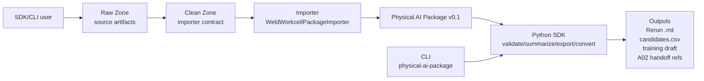

# Stage 9 B06 SDK 化与用户入口收敛设计

## 1. 背景

B06 已经完成 Physical AI Package v0.1、Raw/Clean Zone、validator、summarizer、candidate export、Rerun adapter、training/evaluation draft、external importer contract、LeRobot/CSV/Weld Workcell importer、Stage 7.1 H300 simulated Raw/Clean fixture 和 Stage 8 H300 synthetic demo readiness。当前链路已经通过 synthetic、开放数据、CSV 和业务导出 candidate 多条路径验证，足以证明 B06 的核心数据层能力。

当前最大问题不再是“有没有更多验证样本”，而是用户不知道如何使用这个项目：README 同时呈现大量阶段文档、脚本命令、profile 和研究背景，却没有清楚说明 B06 到底是 SDK、CLI，还是一组 Python scripts。代码事实上已经有 `src/physical_ai_data/`、`sdk.py`、`cli.py` 和 importer contract，但 `pyproject.toml` 没有 console entrypoint，README 主入口仍以 `python scripts/...py` 为主，导致项目看起来像脚本集合。

用户已明确判断：真机验证短期内无法启动，因此 Stage 9 应进入真正的 SDK 化，而不是继续把真实样本当作主门槛。本阶段目标是把已有能力整理成 Pythonic、简洁、显式、不过度封装的 SDK 产品面，并用 README 架构图和使用流程把用户入口讲清楚。

## 2. 目标

Stage 9 完成后，新用户应能在 README 首页快速回答：

1. B06 是什么：一个以 Python SDK 为核心、CLI 为薄入口、fixtures/docs 为 demo/readiness 包的工业物理 AI 数据层工具包。
2. 我该怎么用：SDK 调用、CLI 命令、Stage 8 demo 三条路径。
3. 数据如何流动：Raw/Clean Zone -> importer -> Physical AI Package -> validate/summarize -> candidates/training draft/Rerun/A02 handoff。
4. 现有脚本是什么：兼容和开发入口，不是项目主体。
5. SDK 公共 API 是什么：哪些函数稳定，哪些模块仍是内部或试验性。
6. 下一步如何扩展：新增 importer 或 pipeline helper，而不是先做生产 connector 或 Web 平台。

## 3. 非目标

Stage 9 不做以下事项：

- 不实现 Streamlit/Web app；Web 展示层可以作为后续阶段选项，但不是当前主线。
- 不实现生产 connector、TCP/IP server、SDK bridge、OPC UA/MES/HMI/PLC 直连或 DB ingestion。
- 不设计长期 DB schema。
- 不修改 Physical AI Package v0.1 schema。
- 不把 Stage 8 synthetic fixture 当作真实 H300 协议。
- 不稳定所有 profile 为代码级 schema。
- 不引入插件系统、registry、builder DSL、复杂 OOP 层级或隐藏大量副作用的高级框架。
- 不移除现有 `scripts/`，避免破坏已记录命令和历史文档。

## 4. 设计原则

SDK 必须符合 Python 的通用惯例：

- **显式优先**：用户能看见输入目录、输出目录、artifact 路径和执行步骤。
- **普通函数优先**：使用函数和轻量 dataclass，不新增重型类层级。
- **路径友好**：公共 API 接受 `str | pathlib.Path`。
- **返回结果对象**：SDK 函数返回结构化结果，不依赖 `print` 作为主要接口。
- **薄封装**：pipeline helper 只串联现有步骤，不隐藏 importer、validate、export 和 Rerun 产物。
- **可组合**：底层 API 继续可单独调用，高层 helper 只是 convenience layer。
- **兼容已有命令**：保留 `python scripts/physical_ai_package.py ...`，同时新增标准 console script。
- **不过早抽象**：不做 registry、插件生命周期、自动发现或跨项目大一统 profile schema。

## 5. 方案比较

### 方案 A：只重写 README，继续保留脚本入口

优点是改动小、风险低。缺点是用户仍需要记住 `python scripts/...py`，SDK 与 CLI 的产品面没有被正式承认，项目仍会被误解为脚本集合。

结论：不足以解决当前问题，不采用。

### 方案 B：Pythonic SDK first + CLI entrypoint + README 用户入口重排

优点是贴合现有代码结构，不需要重写核心逻辑；可以把 `physical_ai_data` 明确成主产品面，把 CLI 变成 SDK 的薄入口，把 scripts 降级为兼容/开发 wrapper。新增一个少量代码的 pipeline helper，可以显著降低用户跑通链路的成本。缺点是它不像 Web app 那样有强展示性，但 Stage 8 文档和 Mermaid 架构图已经足够支撑当前展示。

结论：采用。

### 方案 C：直接做 Streamlit 或轻量 Web app

优点是对非工程用户更直观。缺点是会引入新依赖、运行方式、UI 维护和产品边界问题；在 SDK 入口还不清楚时先做 Web，会把项目继续推向 demo，而不是沉淀可复用能力。

结论：暂不采用，可作为 Stage 10+ 展示层选项。

### 方案 D：全面 SDK 平台化和插件化

优点是看起来完整。缺点是过度设计，会在真实业务 importer 和 profile 仍在演进时锁死抽象；也违背“简洁明了，不要过度封装”的要求。

结论：不采用。

## 6. 选定方案

Stage 9 采用方案 B：**Pythonic SDK first + CLI entrypoint + README 用户入口重排**。

本阶段将 B06 明确为：

```text
B06 Physical AI Data Layer
= Python SDK core
+ thin CLI entrypoint
+ compatibility scripts
+ deterministic demo fixtures
+ readiness/profile documentation
```

其中：

- SDK 是主产品面。
- CLI 是面向命令行用户的薄入口。
- `scripts/` 是兼容入口和少量 stage-specific generator，不再作为 README 主叙述中心。
- Stage 8 H300 synthetic demo 是当前默认 demo/readiness 场景。
- Streamlit/Web app 是未来可选展示层，不进入 Stage 9。

## 7. SDK 公共 API 设计

### 7.1 已有基础 API

保留并明确以下顶层 API：

```python
from physical_ai_data import (
    validate,
    summarize,
    export_candidates_csv,
    export_training_eval_draft,
    convert_to_rerun,
)
```

这些函数仍保持薄封装：

- `validate(package_root) -> ValidationResult`
- `summarize(package_root) -> dict[str, object]`
- `export_candidates_csv(package_root, output_csv=None, min_score=0.5) -> Path`
- `export_training_eval_draft(package_root, output_dir=None, split="unspecified") -> Path`
- `convert_to_rerun(package_root, output_rrd) -> Path`

### 7.2 Importer contract API

继续保留显式 importer contract：

```python
from physical_ai_data.importers import ImportRequest, run_import
from physical_ai_data.weld_workcell_importer import WeldWorkcellPackageImporter

result = run_import(
    WeldWorkcellPackageImporter(),
    ImportRequest(
        source_format="weld_workcell",
        source={"root": "clean/weld_workcell"},
        output_dir="package",
        options={"copy_images": True},
    ),
)
```

Stage 9 应把 `ImportRequest.output_dir` 的公共类型拓宽为 `str | Path`，并在 `run_import` 或 importer 边界统一归一化为 `Path`。`source` 中的路径值已经以 mapping 承载，具体 importer 继续负责将 `source["root"]` 归一化为 `Path`。这样示例可以自然使用字符串，同时保持内部实现清晰。

不在 Stage 9 引入 importer registry 或自动发现。新增 importer 仍应显式实例化，让调用边界清楚。

### 7.3 最小 pipeline helper

新增一个轻量模块 `physical_ai_data.pipelines`，只提供明确、少量、高价值 helper：

```python
from physical_ai_data.pipelines import run_weld_workcell_pipeline

result = run_weld_workcell_pipeline(
    clean_root="artifacts/stage8/h300_synthetic_demo/clean/weld_workcell",
    output_dir="artifacts/stage8/h300_synthetic_demo/package",
    output_rrd="artifacts/stage8/h300_synthetic_demo/package.rrd",
    training_split="eval",
)
```

建议返回 dataclass：

```python
@dataclass(frozen=True)
class PipelineResult:
    package_root: Path
    validation: ValidationResult
    summary: dict[str, object]
    candidates_csv: Path | None
    training_draft_dir: Path | None
    rrd_path: Path | None
```

函数行为：

1. 使用 `WeldWorkcellPackageImporter` 从 Clean Zone 导入 package。
2. 若 `run_import` 失败，包括 Clean Zone 缺文件、字段错误、路径非法，或 importer 内部 validation 失败，应抛出 `ValueError`，信息前缀包含 `weld_workcell pipeline failed during import`，并保留原始错误文本。
3. import 成功后，pipeline 再运行一次 `validate` 作为防御性复核。
4. 若防御性复核不通过，抛出 `ValueError`，信息前缀包含 `weld_workcell pipeline produced invalid package`，并包含 validation errors。
5. 返回 `summary`。
6. 可选导出 candidates，默认建议开启。
7. 可选导出 training draft，默认可由 `training_split` 控制；若为 `None` 则不导出。
8. 可选转换 Rerun `.rrd`，只有传入 `output_rrd` 时执行。

默认参数建议：

```python
def run_weld_workcell_pipeline(
    clean_root: str | Path,
    output_dir: str | Path,
    *,
    copy_images: bool = True,
    export_candidates: bool = True,
    candidate_min_score: float = 0.5,
    training_split: str | None = "unspecified",
    output_rrd: str | Path | None = None,
) -> PipelineResult:
    ...
```

这个 helper 不应支持复杂配置对象、插件注册、自动路径推断或隐式网络/数据库行为。

### 7.4 Stage 8 demo helper 是否进入 SDK

`generate_stage8_h300_synthetic_demo` 当前位于 `physical_ai_data.stage8_h300_demo`，可在 README 中作为 demo fixture API 展示，但不放进顶层 `physical_ai_data.__all__`。原因是它是 demo/readiness helper，不是通用数据层 API。

## 8. CLI 设计

### 8.1 Console entrypoint

在 `pyproject.toml` 增加：

```toml
[project.scripts]
physical-ai-package = "physical_ai_data.cli:main"
```

这样用户安装后可以运行：

```bash
physical-ai-package validate path/to/package --json
physical-ai-package summarize path/to/package --json
physical-ai-package export-candidates path/to/package
physical-ai-package export-training-draft path/to/package --split eval
physical-ai-package convert-rerun path/to/package --output-rrd path/to/package.rrd
```

### 8.2 保留 compatibility scripts

保留：

```bash
python scripts/physical_ai_package.py ...
python scripts/generate_stage8_h300_synthetic_demo.py ...
```

但 README 主路径优先使用 `physical-ai-package`。脚本说明应降级为“未安装 console script 时的兼容方式”。

### 8.3 是否新增 pipeline CLI

Stage 9 必须新增一个 CLI 子命令，作为 README 的命令行主路径：

```bash
physical-ai-package run-weld-workcell \
  --clean-root artifacts/stage8/h300_synthetic_demo/clean/weld_workcell \
  --output-dir artifacts/stage8/h300_synthetic_demo/package \
  --training-split eval \
  --output-rrd artifacts/stage8/h300_synthetic_demo/package.rrd
```

该命令应直接调用 `run_weld_workcell_pipeline`，不重复业务逻辑。

该命令必须保留显式参数，不做隐式目录猜测。建议参数：

- `--clean-root`：必需，Clean Zone `weld_workcell` 目录。
- `--output-dir`：必需，输出 Physical AI Package 目录。
- `--copy-images/--no-copy-images`：默认 copy images。
- `--no-candidates`：默认导出 candidates。
- `--candidate-min-score`：默认 `0.5`。
- `--training-split`：默认 `unspecified`；若传 `none` 或空值则不导出 training draft。
- `--output-rrd`：可选，不传则不生成 `.rrd`。
- `--json`：可选，输出 pipeline result 的机器可读摘要。

现有 `validate`、`summarize`、`export-candidates`、`export-training-draft`、`convert-rerun`、`generate`、`import-lerobot` 命令必须保持兼容。

## 9. README 用户入口设计

README 首页应前置一个“如何使用本项目”区域，放在项目定位和历史路线之前。

建议结构：

1. 一句话定位：

```text
B06 是一个 Python SDK first 的工业物理 AI 数据层工具包：用 SDK/CLI 把 Raw/Clean 工业作业数据整理成 Physical AI Package，并导出回放、候选样本、training draft 和 evidence handoff。
```

2. 项目形态：

| 层 | 用户看到什么 | 适合谁 |
| --- | --- | --- |
| SDK | `physical_ai_data` Python package | 研发、平台、数据管线 |
| CLI | `physical-ai-package ...` | 工程对接、离线验收 |
| Demo fixture | Stage 8 H300 synthetic Raw/Clean | 评审、演示、回归 |
| Docs/profile | Stage 8 docs、A01/A02 profiles | 对齐字段和边界 |

3. 架构图：



4. 三分钟跑通：

```bash
python3 -m pip install -e ".[dev]"
python scripts/generate_stage8_h300_synthetic_demo.py --output-root artifacts/stage8/h300_synthetic_demo --frames 5
physical-ai-package run-weld-workcell \
  --clean-root artifacts/stage8/h300_synthetic_demo/clean/weld_workcell \
  --output-dir artifacts/stage8/h300_synthetic_demo/package \
  --training-split eval \
  --output-rrd artifacts/stage8/h300_synthetic_demo/package.rrd
```

`run-weld-workcell` 是 Stage 9 必交付项，因此 README 的三分钟跑通可以把它作为 CLI 主路径。同时 README 仍应提供 SDK pipeline 示例，方便嵌入式调用。

5. SDK 示例：

```python
from physical_ai_data.pipelines import run_weld_workcell_pipeline

result = run_weld_workcell_pipeline(
    clean_root="artifacts/stage8/h300_synthetic_demo/clean/weld_workcell",
    output_dir="artifacts/stage8/h300_synthetic_demo/package",
    training_split="eval",
    output_rrd="artifacts/stage8/h300_synthetic_demo/package.rrd",
)

print(result.summary)
```

6. 什么时候用什么：

- 只想看效果：跑 Stage 8 demo。
- 想接工程导出：准备 `weld_workcell` Clean Zone，用 pipeline 或 importer contract。
- 想嵌入平台：用 SDK 基础函数和 importer contract。
- 想扩展新来源：新增 importer，先不要做生产 connector。

## 10. 文档更新范围

Stage 9 应更新：

- `README.md`：主入口重排、架构图、SDK/CLI/demo 三路径、快速开始。
- `details.md`：记录 Stage 9 SDK 化决策、交付物、验证结果和下一阶段计划。
- `docs/stage8/README.md`：把 Stage 8 demo 命令与 SDK/CLI 新入口对齐。
- 可能新增 `docs/sdk/README.md`：如果 README 过长，则把 SDK API 参考下沉到 `docs/sdk/README.md`。

推荐新增 `docs/sdk/README.md`，用于承载：

- 公共 API 列表。
- pipeline helper 示例。
- importer contract 示例。
- CLI 与 scripts 的关系。
- 稳定/试验 API 边界。

## 11. 代码更新范围

Stage 9 预期改动文件：

- `pyproject.toml`：新增 `[project.scripts] physical-ai-package = "physical_ai_data.cli:main"`。
- `src/physical_ai_data/importers.py`：将 `ImportRequest.output_dir` 公共类型拓宽为 `str | Path`，并在 `run_import` 边界归一化。
- `src/physical_ai_data/pipelines.py`：新增 `PipelineResult` 和 `run_weld_workcell_pipeline`。
- `src/physical_ai_data/__init__.py`：是否导出 pipeline helper 需要谨慎；默认不把 pipeline 放到顶层，README 从 `physical_ai_data.pipelines` 导入。
- `src/physical_ai_data/cli.py`：新增 `run-weld-workcell` 子命令，直接调用 pipeline helper；保留所有现有子命令。
- `tests/physical_ai_data/test_pipelines.py`：覆盖 pipeline 成功、可选输出和错误路径。
- `tests/physical_ai_data/test_cli.py`：覆盖 console-equivalent CLI `run-weld-workcell`，并回归已有 CLI 子命令。
- `tests/physical_ai_data/test_importers.py`：覆盖 `ImportRequest.output_dir` 接受 `str` 的兼容行为。
- `docs/sdk/README.md`：新增 SDK 使用说明。
- `README.md`、`details.md`、`docs/stage8/README.md`：更新用户入口和路线说明。

## 12. 测试策略

Stage 9 必须覆盖：

- `pyproject.toml` console script 是否可通过 installed/editable 环境调用。
- `run_weld_workcell_pipeline` 成功路径。
- import/package-build failure 路径：Clean Zone 缺文件、坏字段、非法路径或 importer 内部 validation 失败时，错误信息包含 `weld_workcell pipeline failed during import` 和原始错误文本。
- defensive validation failure 路径：import 成功后 pipeline 防御性 `validate` 失败时，错误信息包含 `weld_workcell pipeline produced invalid package` 和 validation errors。该路径可通过测试中 monkeypatch pipeline 内部 validate 调用来覆盖，不要求改动 importer 现有 validation 行为。
- 可选输出控制：不传 `output_rrd` 时不生成 Rerun 文件；`training_split=None` 时不生成 training draft。
- 现有 CLI 命令回归：`generate welding`、`generate pick-sort`、`validate`、`summarize`、`export-candidates`、`export-training-draft`、`convert-rerun`、`import-lerobot` 不破坏。
- `scripts/physical_ai_package.py` wrapper 继续可用。
- Stage 8 demo -> pipeline -> outputs 的 smoke。
- README 命令与实际 entrypoint 一致。

## 13. 验收标准

Stage 9 完成后应满足：

- `physical_ai_data.pipelines.run_weld_workcell_pipeline` 可用，返回结构化结果。
- `physical-ai-package` console command 可用。
- `physical-ai-package run-weld-workcell` CLI 子命令能从 Stage 8 Clean Zone 一步生成 package、candidates、training draft 和 `.rrd`。
- 现有 `scripts/physical_ai_package.py` 命令继续可用。
- 现有 CLI 子命令 `generate welding`、`generate pick-sort`、`validate`、`summarize`、`export-candidates`、`export-training-draft`、`convert-rerun`、`import-lerobot` 继续通过测试。
- `ImportRequest.output_dir` 接受 `str | Path`。
- README 首页能清楚回答 SDK、CLI、scripts、demo fixture 的关系。
- README 包含项目架构 Mermaid 图和最小使用流程。
- `docs/sdk/README.md` 或等价文档说明公共 API 和边界。
- `python -m pytest -q` 通过。
- Stage 8 demo pipeline smoke 通过。
- 文档不得暗示已有真实 H300 数据、生产 connector、DB/schema 或 Web app。

## 14. 风险与缓解

- 风险：pipeline helper 变成隐藏复杂度的框架。缓解：只支持 weld workcell 最小路径，参数显式，不做 registry。
- 风险：README 变得更长。缓解：首页保留用户路径和架构图，API 细节下沉 `docs/sdk/README.md`。
- 风险：console script 与 scripts 命令并存造成困惑。缓解：README 明确 console script 是主入口，scripts 是兼容/开发入口。
- 风险：SDK 被误解为生产 connector SDK。缓解：文档重复说明它是数据层 SDK，不负责现场协议和在线接入。
- 风险：过早稳定全部 importer/profile。缓解：只稳定当前已验证基础函数、importer contract 和 weld workcell pipeline。

## 15. 下一阶段建议

Stage 9 完成后，下一阶段可以二选一：

1. **Stage 10 SDK adoption hardening**：补 API 文档、更多 pipeline tests、错误信息、示例 notebooks 或更多 importer helper。
2. **Stage 10 lightweight demo UI**：在 SDK/CLI 入口稳定后，再评估 Streamlit 或其他轻量 Web 展示层，用于浏览 Stage 8 demo、文件树、summary、candidates 和 gap register。

如果仍没有真实/脱敏 H300 样本，优先继续加强 SDK adoption，而不是启动生产 connector 或 DB/schema。
